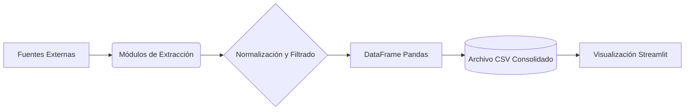

# 📊 Monitor de Empleabilidad - Informe Técnico

**Curso:** Lenguaje de Programación 2  
**Fecha:** 30 Diciembre 2025

---

## 👥 Integrantes del Equipo

| Usuario GitHub | Estudiante | 
| :--- | :--- |
| **@huarcayaariasd-bit** | Huarcaya Arias, Danilo | 
| **@Joseflores23** | Flores Cueva, Jose Armando | 
| **@RichiTM28** | Terreros Mosquera, Wellington Ricardo | |

---

## 1. Descripción y Objetivos 🎯

Este proyecto es una herramienta de **Inteligencia de Negocios (BI)** enfocada en la empleabilidad. Su objetivo es extraer, procesar y visualizar en tiempo real las tecnologías más demandadas para desarrolladores de software, consolidando información de múltiples fuentes internacionales (Latinoamérica, Global Remoto y Startups de Silicon Valley).

---

## 2. Planeación del Diseño y Extracción de Datos 🛠️

### 2.1. Selección de Fuentes
Para garantizar una muestra representativa, se seleccionaron tres fuentes con arquitecturas diferentes:

* **GetOnBoard:** Fuente principal para Latinoamérica (Técnica: *Web Scraping*).
* **Remotive:** Fuente global para trabajo remoto (Técnica: *API REST*).
* **HackerNews:** Fuente de nicho para Startups de alto nivel (Técnica: *API Pública*).

### 2.2. Estrategia de Filtrado: "Lógica de Exclusión"
Durante la fase de análisis, detectamos que filtrar estrictamente por la palabra "Junior" eliminaba el **90%** de las ofertas relevantes, ya que muchas empresas usan títulos genéricos (ej: *"Python Developer"*).

> **Solución Implementada:**
> En lugar de buscar inclusivamente ("Junior"), aplicamos un algoritmo de exclusión:
> *"Aceptar todas las ofertas disponibles, **EXCEPTO** aquellas que contengan explícitamente términos de alta jerarquía (Senior, Lead, Principal, Manager, Architect)."*

### 2.3. Estructuración y Normalización (Data Pipeline)
Se diseñó un esquema unificado para combinar datos de HTML, JSON y Listas:

| Campo Unificado | Origen GetOnBoard | Origen Remotive | Origen HackerNews |
| :--- | :--- | :--- | :--- |
| **Título** | Tag `<a>.title` | Key `job['title']` | Key `story['title']` |
| **Empresa** | Texto inferido | Key `job['company_name']` | String "Startup (HN)" |
| **Descripción** | Título crudo | Título + Tags | Título + Texto |
| **URL** | `href` relativo + Base | Key `job['url']` | URL construida con ID |

---

## 3. Arquitectura del Sistema ⚙️

El sistema sigue el patrón **ETL (Extract, Transform, Load)** integrado en una aplicación web interactiva.



### Tecnologías Clave:
* **Streamlit:** Interfaz gráfica y reactividad (`st.rerun`).
* **BeautifulSoup4:** Parsing de HTML (GetOnBoard).
* **Urllib3:** Configurado para evasión de bloqueos SSL (`verify=False`).
* **Pandas & Matplotlib:** Manipulación tabular y gráficos estadísticos.

---

## 4. Estructura del Repositorio 📂

```text
trabajo_final-lp2/
│
├── app.py                 # (Main) Orquestador de la aplicación web
├── requirements.txt       # Dependencias del proyecto
├── README.md              # Documentación técnica
│
├── modules/               # Capa de Lógica de Negocio (Backend)
│   ├── scraper_getonboard.py  # Web Scraping y manejo SSL
│   ├── api_remotive.py        # Consumo API REST
│   └── api_hackernews.py      # Consumo API Iterativa
│
├── docs/                  # Documentación adicional
│   └── diccionario_datos.md
│
└── data/                  # Capa de Persistencia
    └── ofertas_consolidadas.csv
```

---

## 5. Evidencia del Trabajo en Equipo 🤝

El desarrollo fue modular, permitiendo integración final en `app.py`.

### 👨‍💻 Danilo: Ingeniería de Datos & Scraping
* Implementación de `scraper_getonboard.py` (Manejo complejo de SSL).
* Definición de `requirements.txt`.
* Documentación técnica en `docs/diccionario_datos.md`.

### 👨‍💻 Wellington: Integración API & Documentación
* Implementación de `api_remotive.py` con filtrado de etiquetas.
* Redacción del Informe Técnico (`README.md`).
* Control de calidad (QA) de la documentación.

### 👨‍💻 Jose: Desarrollo Frontend & API Secundaria
* Desarrollo del Dashboard en `app.py` (Streamlit).
* Implementación de `api_hackernews.py`.
* Lógica de visualización y gráficos.

---

## 6. Instrucciones de Instalación 🚀

1.  **Clonar repositorio** o descargar los archivos.
2.  **Instalar dependencias:**
    ```bash
    pip install -r requirements.txt
    ```
3.  **Ejecutar la aplicación:**
    ```bash
    streamlit run app.py
    ```

La aplicación abrirá automáticamente una pestaña en tu navegador predeterminado.


